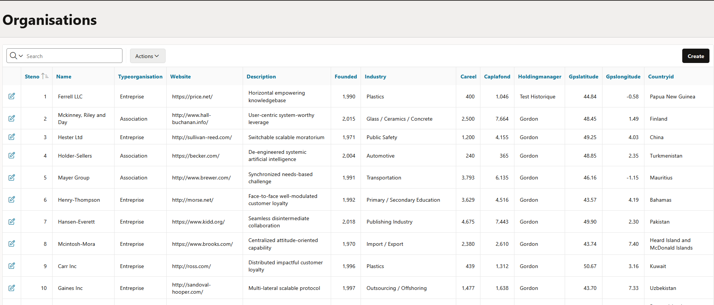
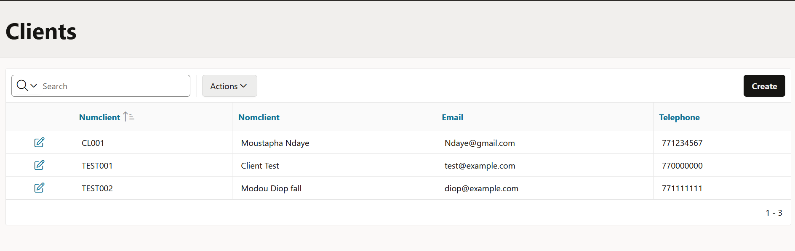
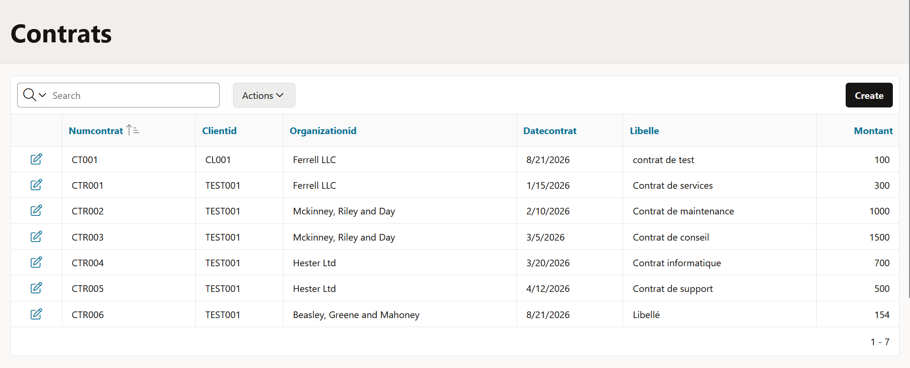
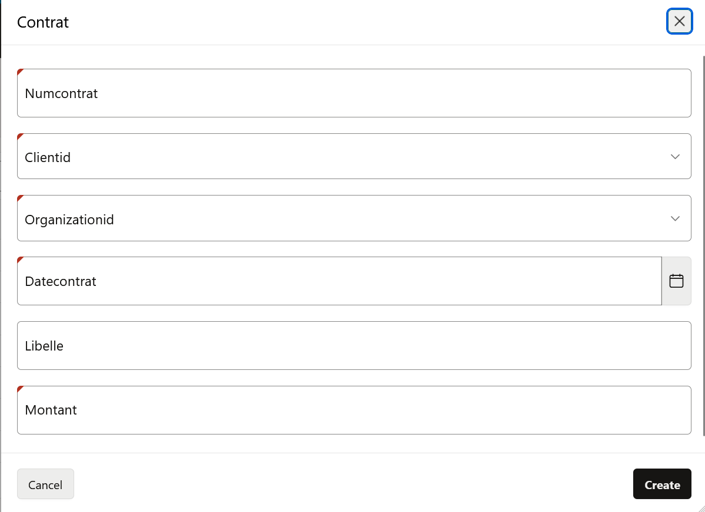
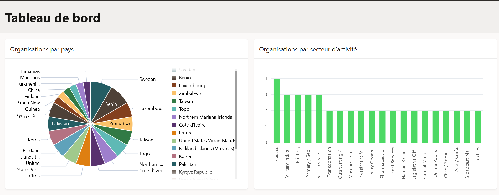
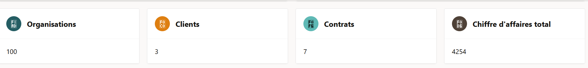
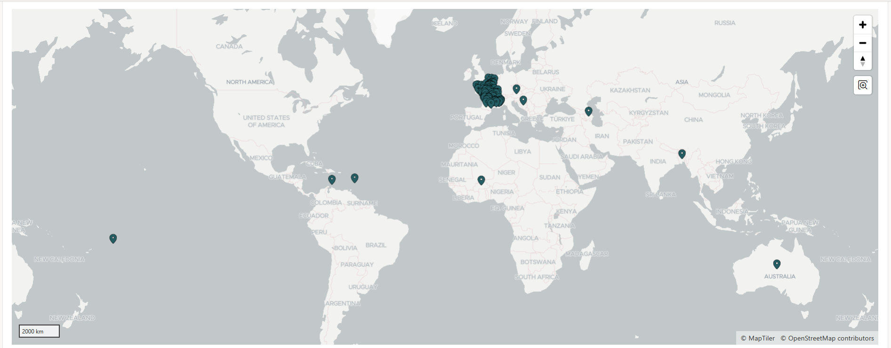
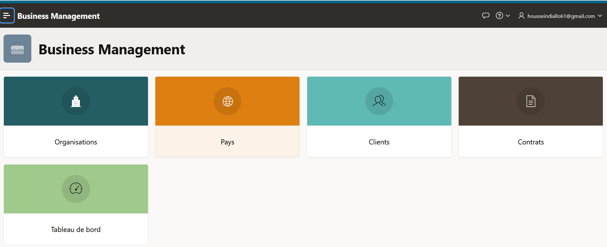
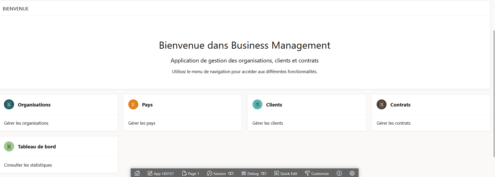
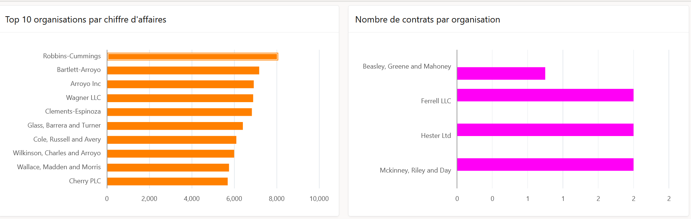

# 🗄️ Oracle APEX Business Management

Application de gestion développée avec **Oracle APEX** dans le cadre d'un projet académique.

L'application permet de gérer et de consulter différentes informations liées aux **organisations, clients et contrats**, à travers une interface web développée avec Oracle APEX.

## 🎯 Objectifs

Ce projet avait pour objectif de mettre en pratique :

* la conception et la gestion d'une base de données ;
* la création d'une application avec Oracle APEX ;
* la gestion des organisations et des clients ;
* la gestion des contrats ;
* la création de tableaux de bord et d'indicateurs ;
* la conception d'interfaces utilisateur adaptées à la gestion des données.

## 🛠️ Technologies utilisées

* **Oracle Database**
* **Oracle APEX**
* **SQL**
* **PL/SQL**
* **HTML / CSS** — personnalisation de l'interface

## ✨ Fonctionnalités

### 🏢 Gestion des organisations

L'application permet de consulter et gérer les différentes organisations enregistrées.

### 👥 Gestion des clients

Une interface permet de consulter les informations relatives aux clients.

### 📄 Gestion des contrats

L'application permet de consulter et gérer les contrats associés aux différentes entités.

### 📝 Formulaire de contrat

Un formulaire permet d'ajouter ou de modifier les informations relatives aux contrats.

### 📊 Dashboard

Des tableaux de bord permettent d'avoir une vue synthétique des données de l'application.

### 📈 Indicateurs

L'application présente également différents indicateurs permettant de suivre les données de manière synthétique.

### 🗺️ Carte

Une vue cartographique permet de visualiser certaines informations géographiques.

## 🖼️ Captures d'écran

### Accueil

### Dashboard

## 📚 Ce que j'ai appris

Ce projet m'a permis de renforcer mes compétences dans :

* la conception de bases de données relationnelles ;
* SQL et PL/SQL ;
* Oracle APEX ;
* la création d'interfaces web avec APEX ;
* la gestion des données à travers une application ;
* la création de dashboards et d'indicateurs ;
* l'organisation et la présentation d'un projet sur GitHub.

## 🔐 À propos de l'export APEX

Pour des raisons de confidentialité, **l'export complet de l'application Oracle APEX n'est pas publié dans ce repository**.

Le repository contient uniquement la documentation et les captures d'écran permettant de présenter le projet.

## 👨‍💻 Auteur

**Hussein Alhoussein**

Étudiant en informatique — Data Science, Machine Learning et Intelligence Artificielle.

---

⭐ Merci d'avoir consulté ce projet !
